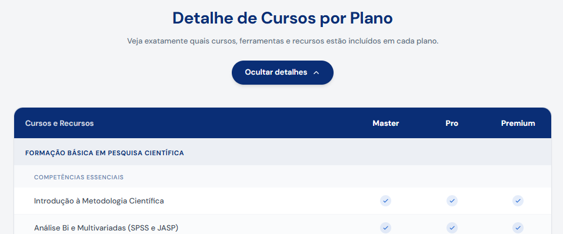

# Referência Completa: Seção "Detalhe de Cursos por Plano"

Este documento contém todo o código-fonte, dados, tipos, dependências e contexto de layout necessários para replicar fielmente a seção expansível "Detalhe de Cursos por Plano" em qualquer aplicação React + Tailwind CSS.

---

## Imagem de Referência do Layout



---

## Visão Geral do Elemento

A seção é composta por:

1. **Título e subtítulo** centralizados com animação de entrada (fade-in + slide-up)
2. **Botão toggle** "Ver todos os cursos por plano" / "Ocultar detalhes" — expande/colapsa toda a tabela detalhada com animação
3. **Tabela Desktop** (`hidden` em mobile, `block` em `md:`) — grid com header sticky azul escuro (Master, Pro, Premium), blocos de formação com subcategorias e cursos individuais, seguidos de blocos de recursos
4. **Tabela Mobile** (`block` em mobile, `hidden` em `md:`) — versão compacta com header sticky dos 3 planos e listagem vertical de cursos com ícones inline
5. **CTA final** "Começar Já" centralizado após as tabelas

A seção usa fundo `#F4F5F7` e está contida em um `max-w-5xl` centralizado.

---

## Dependências Externas

```json
{
  "react": "^18.x",
  "framer-motion": "^10.x ou ^11.x",
  "tailwindcss": "^3.x",
  "lucide-react": "^0.x (qualquer versão recente)",
  "@shadcn/ui": "Button component"
}
```

### Imports necessários

```tsx
import { useState } from "react";
import { motion, AnimatePresence } from "framer-motion";
import { Button } from "@/components/ui/button";
import { Check, X as XIcon, ArrowRight, ChevronDown } from "lucide-react";
```

---

## Paleta de Cores e Tokens de Design

| Token | Valor | Uso |
|---|---|---|
| Azul primário | `#0A2E76` | Títulos, header da tabela, nomes de bloco/categoria |
| Azul CTA | `#0065FF` | Botão "Começar Já" |
| Azul CTA hover | `#0050CC` | Hover do botão |
| Azul check | `#0050CC` | Ícone check (curso disponível) |
| Vermelho erro | `#F34266` | Ícone X (curso indisponível) |
| Fundo seção | `#F4F5F7` | Background da seção |
| Fundo tabela | `#FFFFFF` (white) | Background do card da tabela |
| Fundo alternado | `#FAFBFC` | Linhas alternadas |
| Fundo subcategoria | `#F8F9FB` | Linha de subcategoria |
| Fundo bloco | `#0A2E76` com 8% opacidade | Linha de nome do bloco de formação |
| Borda clara | `#E2E5EA` | Bordas do card e divisores |
| Borda sutil | `#F4F5F7` | Bordas entre linhas |
| Header bg | `#0A2E76` | Fundo do header sticky da tabela |
| Header text | `white` / `white/80` | Texto do header |
| Texto corpo | `hsl(215, 15%, 30%)` | Nomes dos cursos |
| Texto secundário | `hsl(215, 15%, 45%)` | Subtítulo |
| Texto subcategoria | `#0A2E76` com 60% opacidade | Nomes das subcategorias |
| Sombra CTA | `#0065FF/30` | Shadow do botão |

### Fonte heading
A classe `font-heading` é usada nos títulos. Configure no Tailwind como uma font-family customizada.

---

## Tipos TypeScript

```tsx
type PlanAvailability = [boolean, boolean, boolean];

interface DetailedCourse {
  name: string;
  plans: PlanAvailability;
}

interface DetailedSubcategory {
  name: string;
  courses: DetailedCourse[];
}

interface DetailedBlock {
  name: string;
  subcategories: DetailedSubcategory[];
}

interface DetailedResourceRow {
  name: string;
  plans: PlanAvailability | [string, string, string];
}

interface DetailedResourceGroup {
  category: string;
  rows: DetailedResourceRow[];
}
```

---

## Dados dos Cursos por Plano

```tsx
const detailedCourses: DetailedBlock[] = [
  {
    name: "Formação Básica em Pesquisa Científica",
    subcategories: [
      {
        name: "Competências Essenciais",
        courses: [
          { name: "Introdução à Metodologia Científica", plans: [true, true, true] },
          { name: "Análise Bi e Multivariadas (SPSS e JASP)", plans: [true, true, true] },
          { name: "Escrita Científica de Alto Impacto", plans: [true, true, true] },
          { name: "Cálculo de Tamanho Amostral", plans: [true, true, true] },
        ],
      },
      {
        name: "Gerenciadores de Referências",
        courses: [
          { name: "Zotero", plans: [true, true, true] },
          { name: "Mendeley", plans: [true, true, true] },
          { name: "EndNote", plans: [true, true, true] },
        ],
      },
    ],
  },
  {
    name: "Formação Avançada em Psicometria e Análise de Dados",
    subcategories: [
      {
        name: "Modelos Mistos e Hierárquicos",
        courses: [
          { name: "Modelos Lineares Generalizados (GLM)", plans: [false, true, true] },
          { name: "Equações de Estimativas Generalizadas (GEE)", plans: [false, true, true] },
          { name: "Modelos Multinível", plans: [false, true, true] },
          { name: "Análise de Mediação e Moderação", plans: [false, true, true] },
        ],
      },
      {
        name: "Revisões da Literatura e Metanálise",
        courses: [
          { name: "Revisões da Literatura (Narrativa, Escopo e Sistemática)", plans: [false, true, true] },
          { name: "Metanálise", plans: [false, true, true] },
        ],
      },
      {
        name: "Análise de Dados Textuais",
        courses: [
          { name: "IRAMUTEQ", plans: [false, true, true] },
        ],
      },
      {
        name: "Psicometria Básica e Avançada",
        courses: [
          { name: "Construção, Adaptação & Validação de Instrumentos", plans: [false, true, true] },
          { name: "Análise Fatorial Exploratória e Confirmatória", plans: [false, true, true] },
          { name: "Modelagem por Equações Estruturais", plans: [false, true, true] },
          { name: "Teoria de Resposta ao Item (TRI)", plans: [false, true, true] },
          { name: "Análise de Redes: Teoria e Prática", plans: [false, true, true] },
          { name: "Análise de Classes e Perfis Latentes (LCA/LPA)", plans: [false, true, true] },
          { name: "Controle de Aquiescência", plans: [false, true, true] },
          { name: "Controle de Desejabilidade Social", plans: [false, true, true] },
          { name: "Métodos de Escolha Forçada", plans: [false, true, true] },
        ],
      },
      {
        name: "Estudos Epidemiológicos e Populacionais",
        courses: [
          { name: "Análise de Dados de Estudos Epidemiológicos", plans: [false, true, true] },
          { name: "Séries Temporais", plans: [false, true, true] },
          { name: "Pesquisa com Dados Abertos", plans: [false, true, true] },
        ],
      },
    ],
  },
  {
    name: "Formação Completa em Análise de Dados com R",
    subcategories: [
      {
        name: "Fundamentos do R",
        courses: [
          { name: "R: Linguagem, Scripts e Funções", plans: [false, true, true] },
        ],
      },
      {
        name: "Análises Estatísticas e Psicométricas",
        courses: [
          { name: "R: Análises Bi & Multivariadas", plans: [false, true, true] },
          { name: "R: Análise Fatorial e MEE", plans: [false, true, true] },
          { name: "R: Testes Não Paramétricos para Delineamentos Complexos", plans: [false, true, true] },
          { name: "R: Teoria de Resposta ao Item", plans: [false, true, true] },
        ],
      },
      {
        name: "Manipulação e Visualização de Dados",
        courses: [
          { name: "R: ggplot2", plans: [false, true, true] },
          { name: "R: Tidyverse", plans: [false, true, true] },
        ],
      },
    ],
  },
  {
    name: "Inteligência Artificial Aplicada a Pesquisas Científicas",
    subcategories: [
      {
        name: "Machine Learning e IA",
        courses: [
          { name: "Machine Learning Aplicado à Pesquisa Científica", plans: [false, false, true] },
          { name: "Processamento de Linguagem Natural", plans: [false, false, true] },
          { name: "Probabilistic Graph Models", plans: [false, false, true] },
          { name: "Redes Neurais Artificiais", plans: [false, false, true] },
        ],
      },
    ],
  },
  {
    name: "Desenvolvimento Profissional",
    subcategories: [
      {
        name: "Carreira Acadêmica e Mercado",
        courses: [
          { name: "Curso de Preparação para Concursos", plans: [false, false, true] },
          { name: "Viver de Análise de Dados", plans: [false, false, true] },
        ],
      },
    ],
  },
];
```

---

## Dados dos Recursos por Plano

```tsx
const detailedResources: DetailedResourceGroup[] = [
  {
    category: "Ferramentas Estatísticas",
    rows: [
      { name: "Calculadora de Tamanho Amostral", plans: [true, true, true] },
      { name: "Calculadora de Tamanho de Efeito", plans: [true, true, true] },
      { name: "Classificador de Análises Estatísticas", plans: [true, true, true] },
      { name: "Gerador de Sintaxe em R", plans: [true, true, true] },
    ],
  },
  {
    category: "Recursos Didáticos",
    rows: [
      { name: "Biblioteca Eletrônica", plans: [true, true, true] },
      { name: "Glossário Acadêmico", plans: [true, true, true] },
      { name: "Livros Metodológicos", plans: [true, true, true] },
      { name: "Certificados de conclusão", plans: [true, true, true] },
    ],
  },
  {
    category: "Suporte",
    rows: [
      { name: "Chatbot", plans: [true, true, true] },
      { name: "Comunidade de alunos", plans: [true, true, true] },
      { name: "Suporte por email", plans: [false, true, true] },
      { name: "Suporte direto pela plataforma", plans: [false, true, true] },
    ],
  },
  {
    category: "Inteligência Artificial",
    rows: [
      { name: "Tokens incluídos por mês", plans: ["100.000", "300.000", "500.000"] },
    ],
  },
];
```

---

## Componente Auxiliar: DetailedPlanIcon

```tsx
function DetailedPlanIcon({ value }: { value: boolean | string }) {
  if (typeof value === "string") {
    return <span className="font-bold text-[#0A2E76] text-xs">{value}</span>;
  }
  if (value) {
    return (
      <div className="w-5 h-5 rounded-full bg-[#0050CC]/10 flex items-center justify-center mx-auto">
        <Check className="w-3 h-3 text-[#0050CC]" />
      </div>
    );
  }
  return (
    <div className="w-5 h-5 rounded-full bg-[#F34266]/10 flex items-center justify-center mx-auto">
      <XIcon className="w-3 h-3 text-[#F34266]" />
    </div>
  );
}
```

---

## Componente Completo: DetailedBreakdown

```tsx
function DetailedBreakdown() {
  const [isExpanded, setIsExpanded] = useState(false);
  const planNames = ["Master", "Pro", "Premium"];

  return (
    <section className="pb-16 md:pb-20" style={{ backgroundColor: "#F4F5F7" }}>
      <div className="max-w-5xl mx-auto px-4 sm:px-6">
        <motion.div
          initial={{ opacity: 0, y: 20 }}
          whileInView={{ opacity: 1, y: 0 }}
          viewport={{ once: true }}
          transition={{ duration: 0.5 }}
          className="text-center mb-10"
        >
          <h2
            className="text-2xl sm:text-3xl font-heading font-bold text-[#0A2E76] mb-3"
            data-testid="text-detailed-title"
          >
            Detalhe de Cursos por Plano
          </h2>
          <p className="text-sm text-[hsl(215,15%,45%)] max-w-2xl mx-auto leading-relaxed mb-6">
            Veja exatamente quais cursos, ferramentas e recursos estão incluídos em cada plano.
          </p>

          <button
            onClick={() => setIsExpanded(!isExpanded)}
            className="inline-flex items-center gap-2 px-6 py-3 rounded-full text-sm font-semibold transition-all duration-300 bg-[#0A2E76] text-white hover:bg-[#0A2E76]/90 shadow-md"
            data-testid="button-toggle-detailed"
          >
            {isExpanded ? "Ocultar detalhes" : "Ver todos os cursos por plano"}
            <ChevronDown className={`w-4 h-4 transition-transform duration-300 ${isExpanded ? "rotate-180" : ""}`} />
          </button>
        </motion.div>

        <AnimatePresence>
          {isExpanded && (
            <motion.div
              initial={{ opacity: 0 }}
              animate={{ opacity: 1 }}
              exit={{ opacity: 0 }}
              transition={{ duration: 0.3, ease: "easeInOut" }}
            >
              <>
              {/* ==================== DESKTOP TABLE ==================== */}
              <div className="hidden md:block bg-white rounded-2xl border border-[#E2E5EA] shadow-sm">
                <div className="sticky top-[96px] z-30 grid grid-cols-[1fr_120px_120px_120px] border-b border-[#E2E5EA] bg-[#0A2E76] rounded-t-2xl">
                  <div className="px-5 py-4">
                    <span className="text-sm font-semibold text-white/80">Cursos e Recursos</span>
                  </div>
                  {planNames.map((name) => (
                    <div key={name} className="px-3 py-4 text-center">
                      <span className="text-sm font-bold text-white">{name}</span>
                    </div>
                  ))}
                </div>

                {detailedCourses.map((block, bi) => (
                  <div key={bi}>
                    <div className="grid grid-cols-[1fr_120px_120px_120px] bg-[#0A2E76]/[0.08]">
                      <div className="px-5 py-3">
                        <span className="text-xs font-bold uppercase tracking-wider text-[#0A2E76]">
                          {block.name}
                        </span>
                      </div>
                      <div /><div /><div />
                    </div>

                    {block.subcategories.map((sub, si) => (
                      <div key={si}>
                        <div className="grid grid-cols-[1fr_120px_120px_120px] bg-[#F8F9FB]">
                          <div className="px-5 py-2 pl-9">
                            <span className="text-[11px] font-semibold uppercase tracking-wider text-[#0A2E76]/60">
                              {sub.name}
                            </span>
                          </div>
                          <div /><div /><div />
                        </div>
                        {sub.courses.map((course, ci) => (
                          <div
                            key={ci}
                            className={`grid grid-cols-[1fr_120px_120px_120px] border-b border-[#F4F5F7] ${ci % 2 === 1 ? "bg-[#FAFBFC]" : ""}`}
                          >
                            <div className="px-5 py-3 pl-9">
                              <span className="text-sm text-[hsl(215,15%,30%)]">{course.name}</span>
                            </div>
                            {course.plans.map((val, vi) => (
                              <div key={vi} className="px-3 py-3 flex items-center justify-center">
                                <DetailedPlanIcon value={val} />
                              </div>
                            ))}
                          </div>
                        ))}
                      </div>
                    ))}
                  </div>
                ))}

                <div className="border-t-2 border-[#E2E5EA]" />

                {detailedResources.map((group, gi) => (
                  <div key={gi}>
                    <div className="grid grid-cols-[1fr_120px_120px_120px] bg-[#0A2E76]/[0.08]">
                      <div className="px-5 py-3">
                        <span className="text-xs font-bold uppercase tracking-wider text-[#0A2E76]">
                          {group.category}
                        </span>
                      </div>
                      <div /><div /><div />
                    </div>
                    {group.rows.map((row, ri) => (
                      <div
                        key={ri}
                        className={`grid grid-cols-[1fr_120px_120px_120px] border-b border-[#F4F5F7] ${ri % 2 === 1 ? "bg-[#FAFBFC]" : ""}`}
                      >
                        <div className="px-5 py-3">
                          <span className="text-sm text-[hsl(215,15%,30%)]">{row.name}</span>
                        </div>
                        {row.plans.map((val, vi) => (
                          <div key={vi} className="px-3 py-3 flex items-center justify-center">
                            <DetailedPlanIcon value={val} />
                          </div>
                        ))}
                      </div>
                    ))}
                  </div>
                ))}
              </div>

              {/* ==================== MOBILE TABLE ==================== */}
              <div className="md:hidden bg-white rounded-2xl border border-[#E2E5EA] shadow-sm">
                <div className="sticky top-[88px] z-30 grid grid-cols-[1fr_1fr_1fr] border-b border-[#E2E5EA] bg-[#0A2E76] rounded-t-2xl">
                  {planNames.map((name) => (
                    <div key={name} className="py-3 text-center">
                      <span className="text-[11px] font-bold text-white">{name}</span>
                    </div>
                  ))}
                </div>

                {detailedCourses.map((block, bi) => (
                  <div key={bi}>
                    <div className="px-4 py-3 bg-[#0A2E76]/[0.06]">
                      <span className="text-xs font-bold uppercase tracking-wider text-[#0A2E76]">
                        {block.name}
                      </span>
                    </div>

                    {block.subcategories.map((sub, si) => (
                      <div key={si}>
                        <div className="px-4 py-2 bg-[#F8F9FB]">
                          <span className="text-[10px] font-semibold uppercase tracking-wider text-[#0A2E76]/60">
                            {sub.name}
                          </span>
                        </div>
                        {sub.courses.map((course, ci) => (
                          <div key={ci} className={`border-b border-[#F4F5F7] ${ci % 2 === 1 ? "bg-[#FAFBFC]" : ""}`}>
                            <div className="px-4 py-2">
                              <span className="text-xs text-[hsl(215,15%,30%)]">{course.name}</span>
                            </div>
                            <div className="grid grid-cols-3 pb-2.5">
                              {course.plans.map((val, vi) => (
                                <div key={vi} className="flex justify-center">
                                  <DetailedPlanIcon value={val} />
                                </div>
                              ))}
                            </div>
                          </div>
                        ))}
                      </div>
                    ))}
                  </div>
                ))}

                <div className="border-t-2 border-[#E2E5EA]" />

                {detailedResources.map((group, gi) => (
                  <div key={gi}>
                    <div className="px-4 py-3 bg-[#0A2E76]/[0.06]">
                      <span className="text-xs font-bold uppercase tracking-wider text-[#0A2E76]">
                        {group.category}
                      </span>
                    </div>
                    {group.rows.map((row, ri) => (
                      <div key={ri} className={`border-b border-[#F4F5F7] ${ri % 2 === 1 ? "bg-[#FAFBFC]" : ""}`}>
                        <div className="px-4 py-2">
                          <span className="text-xs text-[hsl(215,15%,30%)]">{row.name}</span>
                        </div>
                        <div className="grid grid-cols-3 pb-2.5">
                          {row.plans.map((val, vi) => (
                            <div key={vi} className="flex justify-center">
                              <DetailedPlanIcon value={val} />
                            </div>
                          ))}
                        </div>
                      </div>
                    ))}
                  </div>
                ))}
              </div>

              {/* ==================== CTA FINAL ==================== */}
              <div className="flex justify-center mt-10">
                <a
                  href="https://psicometriaonline.com.br/academy/"
                  target="_blank"
                  rel="noopener noreferrer"
                  data-testid="button-detailed-cta"
                >
                  <Button
                    className="bg-[#0065FF] text-white font-semibold rounded-full px-10 py-6 text-base hover:bg-[#0050CC] shadow-lg shadow-[#0065FF]/30 gap-2"
                  >
                    Começar Já
                    <ArrowRight className="w-4 h-4" />
                  </Button>
                </a>
              </div>
              </>
            </motion.div>
          )}
        </AnimatePresence>
      </div>
    </section>
  );
}
```

---

## Estrutura da Tabela Desktop (Grid Layout)

A tabela desktop usa CSS Grid com a seguinte estrutura de colunas:

```
grid-cols-[1fr_120px_120px_120px]
```

- **1fr** — coluna de nome do curso/recurso (ocupa o espaço restante)
- **120px** — coluna Master
- **120px** — coluna Pro
- **120px** — coluna Premium

### Hierarquia visual (desktop):

```
┌─────────────────────────────────────────────────────────────┐
│ [Header sticky] Cursos e Recursos | Master | Pro | Premium │ ← bg-[#0A2E76], rounded-t-2xl
├─────────────────────────────────────────────────────────────┤
│ FORMAÇÃO BÁSICA EM PESQUISA CIENTÍFICA                     │ ← bg-[#0A2E76]/[0.08], uppercase, bold
├─────────────────────────────────────────────────────────────┤
│   COMPETÊNCIAS ESSENCIAIS                                  │ ← bg-[#F8F9FB], text-[11px], pl-9
├─────────────────────────────────────────────────────────────┤
│     Introdução à Metodologia Científica  |  ✓  |  ✓  |  ✓ │ ← pl-9, text-sm
│     Análise Bi e Multivariadas           |  ✓  |  ✓  |  ✓ │ ← alternating bg-[#FAFBFC]
├─────────────────────────────────────────────────────────────┤
│ ══════════════ border-t-2 ══════════════                   │ ← separador entre cursos e recursos
├─────────────────────────────────────────────────────────────┤
│ FERRAMENTAS ESTATÍSTICAS                                   │ ← mesma estrutura dos blocos
│   Calculadora de Tamanho Amostral        |  ✓  |  ✓  |  ✓ │
└─────────────────────────────────────────────────────────────┘
                    [ Começar Já → ]                           ← CTA centralizado
```

---

## Estrutura da Tabela Mobile

No mobile, o layout muda:

- Header sticky com `grid-cols-[1fr_1fr_1fr]` mostrando apenas os nomes dos planos
- Cada curso mostra seu nome em uma linha e os 3 ícones abaixo em `grid grid-cols-3`
- Nomes dos blocos e subcategorias ficam em linhas separadas com fundo diferenciado

---

## Comportamento e Interações

### Botão Toggle
- **Estado colapsado**: Texto "Ver todos os cursos por plano" com ícone `ChevronDown` apontando para baixo
- **Estado expandido**: Texto "Ocultar detalhes" com ícone `ChevronDown` rotacionado 180° (apontando para cima)
- **Animação do conteúdo**: fade-in/out com `framer-motion` (`opacity: 0 → 1` e vice-versa, duração 0.3s)
- **Estilo do botão**: `rounded-full`, fundo `#0A2E76`, texto branco, `shadow-md`

### Header Sticky
- **Desktop**: `top-[96px]` — ajustar conforme altura do header/navbar da sua aplicação
- **Mobile**: `top-[88px]` — ajustar conforme header
- **z-index**: `z-30` para ficar acima do conteúdo durante scroll

### Ícones
- `true` → círculo `w-5 h-5` com fundo `bg-[#0050CC]/10` e `Check` azul (`w-3 h-3`)
- `false` → círculo `w-5 h-5` com fundo `bg-[#F34266]/10` e `XIcon` vermelho (`w-3 h-3`)
- `string` → texto bold azul `text-xs` (usado para valores numéricos como tokens)

### CTA Final
- Botão `rounded-full` com fundo `#0065FF`, texto branco, sombra `#0065FF/30`
- Ícone `ArrowRight` ao lado do texto
- Link externo com `target="_blank"`

---

## Notas para Implementação

1. **Ajustar `top` do sticky**: Os valores `top-[96px]` (desktop) e `top-[88px]` (mobile) dependem da altura do header/navbar da aplicação destino.

2. **Link do CTA**: O botão aponta para `https://psicometriaonline.com.br/academy/`. Substitua pela URL desejada.

3. **`font-heading`**: Classe customizada de fonte. Configure no `tailwind.config.ts` ou substitua por `font-sans`.

4. **`data-testid`**: Atributos de teste incluídos nos elementos interativos e informativos.

5. **Sem animação (fallback)**: Se não quiser usar `framer-motion`, substitua `motion.div` por `div`, remova `AnimatePresence`, e use renderização condicional simples (`{isExpanded && <div>...</div>}`).

6. **shadcn Button**: Se não estiver usando shadcn, substitua `<Button>` por `<button>` nativo com as mesmas classes Tailwind.

7. **Dados separados**: Note que cursos (`detailedCourses`) e recursos (`detailedResources`) usam tipos diferentes. Cursos têm subcategorias com hierarquia de 3 níveis (bloco → subcategoria → curso). Recursos são flat (categoria → linhas).

8. **Divisor visual**: Entre cursos e recursos há um `<div className="border-t-2 border-[#E2E5EA]" />` como separador visual.
