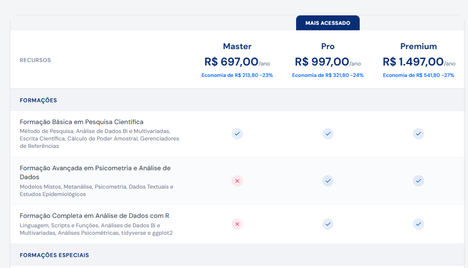

# Referência Completa: Seção "Planos e Preços"

Este documento contém todo o código-fonte, dados, tipos, dependências e contexto de layout necessários para replicar fielmente a seção de **Planos e Preços** em qualquer aplicação React + Tailwind CSS.

---

## Imagem de Referência do Layout



---

## Visão Geral do Elemento

A seção é composta por:

1. **Título e subtítulo** centralizados com animação de entrada (fade-in + slide-up)
2. **Toggle Mensal / Anual** — botão pill que alterna entre os dois períodos de cobrança, com badge "até -27%" no botão anual
3. **Tabela Desktop** (`hidden` em mobile, `block` em `md:`) — tabela comparativa de 3 planos (Master, Pro, Premium) com cabeçalho sticky, categorias de features agrupadas, ícones de check/x, e CTAs por plano
4. **Accordion Mobile** (`block` em mobile, `hidden` em `md:`) — versão compacta com cabeçalho sticky dos planos e categorias colapsáveis com animação

A seção inteira usa fundo `#F4F5F7` e está contida em um `max-w-5xl` centralizado.

---

## Dependências Externas

```json
{
  "react": "^18.x",
  "framer-motion": "^10.x ou ^11.x",
  "tailwindcss": "^3.x",
  "lucide-react": "^0.x (qualquer versão recente)",
  "@shadcn/ui": "Button component"
}
```

### Imports necessários

```tsx
import { useState } from "react";
import { motion, AnimatePresence } from "framer-motion";
import { Button } from "@/components/ui/button"; // shadcn Button
import { Check, X as XIcon, ArrowRight, Plus, Minus } from "lucide-react";
```

---

## Paleta de Cores e Tokens de Design

| Token | Valor | Uso |
|---|---|---|
| Azul primário | `#0A2E76` | Títulos, headers de tabela, textos de destaque |
| Azul CTA | `#0065FF` | Botões de ação, links de economia |
| Azul CTA hover | `#0050CC` | Hover dos botões |
| Vermelho erro | `#F34266` | Ícone X (feature indisponível) |
| Azul check | `#0050CC` | Ícone check (feature disponível) |
| Verde badge | `green-500` (Tailwind) | Badge de desconto no toggle anual |
| Fundo seção | `#F4F5F7` | Background da seção inteira |
| Fundo alternado | `#FAFBFC` | Linhas alternadas da tabela |
| Borda clara | `#E2E5EA` | Bordas da tabela e divisores |
| Borda sutil | `#F4F5F7` | Bordas entre linhas de feature |
| Texto secundário | `hsl(215, 15%, 45%)` | Subtítulos, descrições |
| Texto corpo | `hsl(215, 15%, 30%)` | Labels de features |
| Texto terciário | `hsl(215, 15%, 55%)` | Sub-labels, sufixos de preço |
| Fundo categoria | `#0A2E76` com 6% opacidade | Linhas de categoria na tabela |
| Sombra CTA | `#0065FF/30` | Shadow do botão principal |

### Fonte heading
A classe `font-heading` é usada nos títulos e preços. Configure no Tailwind como uma font-family customizada (ex: Inter, Poppins, ou a fonte do seu projeto).

---

## Tipos TypeScript

```tsx
type BillingPeriod = "mensal" | "anual";

interface PlanHeader {
  id: string;
  name: string;
  monthlyPrice: number;
  yearlyPrice: number;
  yearlyTotal: number;
  badge?: string;
  cta: string;
}

type CellValue = boolean | string;

interface FeatureRow {
  label: string;
  sub?: string;
  values: [CellValue, CellValue, CellValue];
}

interface CategoryGroup {
  category: string;
  rows: FeatureRow[];
}
```

---

## Dados dos Planos

```tsx
const planHeaders: PlanHeader[] = [
  {
    id: "master",
    name: "Master",
    monthlyPrice: 75.90,
    yearlyPrice: 58.08,
    yearlyTotal: 697.00,
    cta: "Começar Grátis",
  },
  {
    id: "pro",
    name: "Pro",
    monthlyPrice: 109.90,
    yearlyPrice: 83.08,
    yearlyTotal: 997.00,
    badge: "Mais acessado",
    cta: "Começar Grátis",
  },
  {
    id: "premium",
    name: "Premium",
    monthlyPrice: 169.90,
    yearlyPrice: 124.75,
    yearlyTotal: 1497.00,
    cta: "Começar Grátis",
  },
];
```

---

## Dados da Tabela de Features

```tsx
const featureTable: CategoryGroup[] = [
  {
    category: "Formações",
    rows: [
      { label: "Formação Básica em Pesquisa Científica", sub: "Método de Pesquisa, Análise de Dados Bi e Multivariadas, Escrita Científica, Cálculo de Poder Amostral, Gerenciadores de Referências", values: [true, true, true] },
      { label: "Formação Avançada em Psicometria e Análise de Dados", sub: "Modelos Mistos, Metanálise, Psicometria, Dados Textuais e Estudos Epidemiológicos", values: [false, true, true] },
      { label: "Formação Completa em Análise de Dados com R", sub: "Linguagem, Scripts e Funções, Análises de Dados Bi e Multivariadas, Análises Psicométricas, tidyverse e ggplot2", values: [false, true, true] },
    ],
  },
  {
    category: "Formações Especiais",
    rows: [
      { label: "Curso de Preparação para Concursos", values: [false, false, true] },
      { label: "Formação Viver de Análise de Dados", values: [false, false, true] },
      { label: "Inteligência Artificial Aplicada a Pesquisas Científicas", values: [false, false, true] },
    ],
  },
  {
    category: "Ferramentas Estatísticas",
    rows: [
      { label: "Calculadora de Tamanho Amostral", values: [true, true, true] },
      { label: "Calculadora de Tamanho de Efeito", values: [true, true, true] },
      { label: "Classificador de Análises Estatísticas", values: [true, true, true] },
      { label: "Gerador de Sintaxe em R", values: [true, true, true] },
    ],
  },
  {
    category: "Recursos Didáticos",
    rows: [
      { label: "Biblioteca Eletrônica", values: [true, true, true] },
      { label: "Glossário Acadêmico", values: [true, true, true] },
      { label: "Livros Metodológicos", values: [true, true, true] },
      { label: "Certificados de conclusão", values: [true, true, true] },
    ],
  },
  {
    category: "Suporte",
    rows: [
      { label: "Chatbot", values: [true, true, true] },
      { label: "Comunidade de alunos", values: [true, true, true] },
      { label: "Suporte por email", values: [false, true, true] },
      { label: "Suporte direto pela plataforma", values: [false, true, true] },
    ],
  },
  {
    category: "Inteligência Artificial",
    rows: [
      { label: "Tokens incluídos por mês", values: ["100.000", "300.000", "500.000"] },
    ],
  },
];
```

---

## Funções Auxiliares

```tsx
function formatPrice(price: number) {
  return price.toLocaleString("pt-BR", {
    style: "currency",
    currency: "BRL",
    minimumFractionDigits: 2,
  });
}

function CellIcon({ value }: { value: CellValue }) {
  if (typeof value === "string") {
    return <span className="font-bold text-[#0A2E76] text-sm">{value}</span>;
  }
  if (value) {
    return (
      <div className="w-6 h-6 rounded-full bg-[#0050CC]/10 flex items-center justify-center mx-auto">
        <Check className="w-3.5 h-3.5 text-[#0050CC]" />
      </div>
    );
  }
  return (
    <div className="w-6 h-6 rounded-full bg-[#F34266]/10 flex items-center justify-center mx-auto">
      <XIcon className="w-3.5 h-3.5 text-[#F34266]" />
    </div>
  );
}
```

---

## Componente: MobileAccordion

Versão mobile da tabela de planos. Visível apenas em telas menores que `md` (< 768px). Usa accordion com animação para expandir/colapsar categorias.

```tsx
function MobileAccordion({ billing }: { billing: BillingPeriod }) {
  const [expanded, setExpanded] = useState<Record<number, boolean>>({});

  const toggle = (index: number) => {
    setExpanded((prev) => ({ ...prev, [index]: !prev[index] }));
  };

  return (
    <div className="md:hidden">
      <div className="sticky top-[88px] z-30" style={{ backgroundColor: "#F4F5F7" }}>
        <div className="bg-white rounded-t-2xl border border-[#E2E5EA] shadow-sm">
          <div className="grid grid-cols-3 divide-x divide-[#E2E5EA]">
            {planHeaders.map((plan) => {
              const price = billing === "mensal" ? plan.monthlyPrice : plan.yearlyPrice;
              return (
                <div key={plan.id} className="p-2 text-center relative" data-testid={`mobile-th-${plan.id}`}>
                  {plan.badge && (
                    <span className="absolute -top-6 left-1/2 -translate-x-1/2 inline-block px-3 py-1 rounded-t-lg text-[8px] font-bold uppercase tracking-wider bg-[#0A2E76] text-white whitespace-nowrap">
                      {plan.badge}
                    </span>
                  )}
                  <div className="font-heading font-bold text-xs text-[#0A2E76]">{plan.name}</div>
                  {billing === "mensal" ? (
                    <div className="text-sm font-heading font-bold text-[#0A2E76] mt-0.5">
                      {formatPrice(plan.monthlyPrice)}
                      <span className="text-[9px] font-normal text-[hsl(215,15%,55%)]">/mês</span>
                    </div>
                  ) : (
                    <>
                      <div className="text-sm font-heading font-bold text-[#0A2E76] mt-0.5">
                        {formatPrice(plan.yearlyTotal)}
                        <span className="text-[9px] font-normal text-[hsl(215,15%,55%)]">/ano</span>
                      </div>
                      <p className="text-[8px] text-[#0065FF] font-semibold mt-0.5 leading-tight">
                        -{Math.round(((plan.monthlyPrice * 12 - plan.yearlyTotal) / (plan.monthlyPrice * 12)) * 100)}%
                      </p>
                    </>
                  )}
                </div>
              );
            })}
          </div>
        </div>
      </div>

      <div className="bg-white rounded-b-2xl border-x border-b border-[#E2E5EA] shadow-sm">
        {featureTable.map((group, gi) => (
          <div key={gi}>
            <button
              onClick={() => toggle(gi)}
              className="w-full flex items-center justify-between px-4 py-3 bg-[#0A2E76]/[0.06]"
              data-testid={`mobile-toggle-${gi}`}
            >
              <span className="text-xs font-bold uppercase tracking-wider text-[#0A2E76]">
                {group.category}
              </span>
              {expanded[gi] ? (
                <Minus className="w-4 h-4 text-[#0A2E76]" />
              ) : (
                <Plus className="w-4 h-4 text-[#0A2E76]" />
              )}
            </button>
            <AnimatePresence>
              {expanded[gi] && (
                <motion.div
                  initial={{ height: 0, opacity: 0 }}
                  animate={{ height: "auto", opacity: 1 }}
                  exit={{ height: 0, opacity: 0 }}
                  transition={{ duration: 0.25 }}
                  className="overflow-hidden"
                >
                  {group.rows.map((row, ri) => (
                    <div
                      key={ri}
                      className={`border-b border-[#F4F5F7] ${ri % 2 === 1 ? "bg-[#FAFBFC]" : ""}`}
                    >
                      <div className="px-4 py-2.5">
                        <span className="text-xs text-[hsl(215,15%,30%)]">{row.label}</span>
                        {row.sub && (
                          <span className="block text-[10px] text-[hsl(215,15%,55%)] mt-0.5">{row.sub}</span>
                        )}
                      </div>
                      <div className="grid grid-cols-3 pb-3">
                        {row.values.map((val, vi) => (
                          <div key={vi} className="flex justify-center">
                            <CellIcon value={val} />
                          </div>
                        ))}
                      </div>
                    </div>
                  ))}
                </motion.div>
              )}
            </AnimatePresence>
          </div>
        ))}

        <div className="flex justify-center p-4 border-t-2 border-[#E2E5EA]">
          <a
            href="https://psicometriaonline.com.br/academy/"
            target="_blank"
            rel="noopener noreferrer"
            data-testid="mobile-cta-main"
          >
            <Button
              className="bg-[#0065FF] text-white font-semibold hover:bg-[#0050CC] px-8"
            >
              Começar Grátis
            </Button>
          </a>
        </div>
      </div>
    </div>
  );
}
```

---

## Componente: DesktopTable

Versão desktop da tabela comparativa. Visível apenas em telas `md:` e maiores (>= 768px). Usa `<table>` HTML com cabeçalho sticky.

```tsx
function DesktopTable({ billing }: { billing: BillingPeriod }) {
  return (
    <div className="hidden md:block relative bg-white rounded-2xl border border-[#E2E5EA] shadow-sm">
      <table className="w-full border-collapse table-fixed" data-testid="table-plans">
        <colgroup>
          <col className="w-[40%]" />
          <col className="w-[20%]" />
          <col className="w-[20%]" />
          <col className="w-[20%]" />
        </colgroup>
        <thead className="sticky top-[96px] z-30">
          <tr>
            <td colSpan={4} className="p-0" style={{ backgroundColor: "#F4F5F7" }}>
              <div className="flex" style={{ paddingLeft: "40%" }}>
                {planHeaders.map((plan) => (
                  <div key={plan.id} className="flex-1 flex justify-center">
                    {plan.badge && (
                      <span
                        className="inline-block px-5 py-2 rounded-t-lg text-[11px] font-bold uppercase tracking-wider bg-[#0A2E76] text-white"
                        data-testid={`badge-plan-${plan.id}`}
                      >
                        {plan.badge}
                      </span>
                    )}
                  </div>
                ))}
              </div>
            </td>
          </tr>
          <tr className="bg-white border-b border-[#E2E5EA]">
            <th className="p-5 text-left align-middle font-normal">
              <span className="text-xs font-semibold uppercase tracking-wider text-[hsl(215,15%,55%)]">
                Recursos
              </span>
            </th>
            {planHeaders.map((plan) => (
              <th key={plan.id} className="p-5 text-center align-middle font-normal" data-testid={`th-plan-${plan.id}`}>
                <div className="font-heading font-bold text-lg text-[#0A2E76]">{plan.name}</div>
                {billing === "mensal" ? (
                  <div className="text-2xl font-heading font-bold text-[#0A2E76] mt-1">
                    {formatPrice(plan.monthlyPrice)}
                    <span className="text-xs font-normal text-[hsl(215,15%,55%)]">/mês</span>
                  </div>
                ) : (
                  <>
                    <div className="text-2xl font-heading font-bold text-[#0A2E76] mt-1">
                      {formatPrice(plan.yearlyTotal)}
                      <span className="text-xs font-normal text-[hsl(215,15%,55%)]">/ano</span>
                    </div>
                    <p className="text-[11px] text-[#0065FF] font-semibold mt-1">
                      Economia de {formatPrice(plan.monthlyPrice * 12 - plan.yearlyTotal)} -{Math.round(((plan.monthlyPrice * 12 - plan.yearlyTotal) / (plan.monthlyPrice * 12)) * 100)}%
                    </p>
                  </>
                )}
              </th>
            ))}
          </tr>
        </thead>
        <tbody>
          {featureTable.map((group, gi) => (
            <>
              <tr key={`cat-${gi}`} className="bg-[#0A2E76]/[0.06]">
                <td colSpan={4} className="px-5 py-3">
                  <span className="text-xs font-bold uppercase tracking-wider text-[#0A2E76]">
                    {group.category}
                  </span>
                </td>
              </tr>
              {group.rows.map((row, ri) => (
                <tr
                  key={`row-${gi}-${ri}`}
                  className={`border-b border-[#F4F5F7] ${ri % 2 === 1 ? "bg-[#FAFBFC]" : ""}`}
                >
                  <td className="px-5 py-3.5 text-sm text-[hsl(215,15%,30%)]">
                    {row.label}
                    {row.sub && (
                      <span className="block text-xs text-[hsl(215,15%,55%)] mt-0.5">{row.sub}</span>
                    )}
                  </td>
                  {row.values.map((val, vi) => (
                    <td key={vi} className="px-5 py-3.5 text-center">
                      <CellIcon value={val} />
                    </td>
                  ))}
                </tr>
              ))}
            </>
          ))}
          <tr className="border-t-2 border-[#E2E5EA]">
            <td className="p-5" />
            {planHeaders.map((plan) => (
              <td key={plan.id} className="p-5 text-center">
                <a
                  href="https://psicometriaonline.com.br/academy/"
                  target="_blank"
                  rel="noopener noreferrer"
                  data-testid={`button-plan-cta-${plan.id}`}
                >
                  <Button
                    className="w-full bg-[#0065FF] text-white font-semibold hover:bg-[#0050CC] gap-2"
                  >
                    {plan.cta}
                    <ArrowRight className="w-4 h-4" />
                  </Button>
                </a>
              </td>
            ))}
          </tr>
        </tbody>
      </table>
    </div>
  );
}
```

---

## Seção Wrapper Completa (componente pai)

Este é o componente completo que une tudo: título, subtítulo, toggle de billing e as duas variantes (desktop/mobile). Para usar, basta renderizar `<PricingSection />` dentro de qualquer página.

```tsx
function PricingSection() {
  const [billing, setBilling] = useState<BillingPeriod>("anual");

  return (
    <section className="pt-16 md:pt-20 pb-20 md:pb-28" style={{ backgroundColor: "#F4F5F7" }}>
      <div className="max-w-5xl mx-auto px-4 sm:px-6">
        <motion.div
          initial={{ opacity: 0, y: 20 }}
          whileInView={{ opacity: 1, y: 0 }}
          viewport={{ once: true }}
          transition={{ duration: 0.5 }}
          className="text-center mb-12"
        >
          <h2
            className="text-2xl sm:text-3xl md:text-4xl font-heading font-bold text-[#0A2E76] mb-4"
            data-testid="text-planos-pricing-title"
          >
            Planos e Preços
          </h2>
          <p className="text-base text-[hsl(215,15%,45%)] max-w-2xl mx-auto leading-relaxed mb-8">
            Comece com acesso completo por 14 dias e escolha o plano que acompanhará o seu ritmo de crescimento.
          </p>

          <div className="flex justify-center">
            <div
              className="inline-flex items-center p-1 rounded-full bg-[#0A2E76]/5 border border-[#0A2E76]/10"
              data-testid="toggle-billing"
            >
              <button
                onClick={() => setBilling("mensal")}
                className={`px-6 py-2.5 rounded-full text-sm font-semibold transition-all duration-300 ${
                  billing === "mensal"
                    ? "bg-[#0A2E76] text-white shadow-md"
                    : "text-[#0A2E76]/60 hover:text-[#0A2E76]"
                }`}
                data-testid="button-billing-mensal"
              >
                Mensal
              </button>
              <button
                onClick={() => setBilling("anual")}
                className={`px-6 py-2.5 rounded-full text-sm font-semibold transition-all duration-300 relative ${
                  billing === "anual"
                    ? "bg-[#0A2E76] text-white shadow-md"
                    : "text-[#0A2E76]/60 hover:text-[#0A2E76]"
                }`}
                data-testid="button-billing-anual"
              >
                Anual
                <span className="absolute -top-2.5 -right-6 px-1.5 py-0.5 rounded-full text-[10px] font-bold bg-green-500 text-white leading-none whitespace-nowrap">
                  até -27%
                </span>
              </button>
            </div>
          </div>
        </motion.div>

        <motion.div
          initial={{ opacity: 0, y: 20 }}
          whileInView={{ opacity: 1, y: 0 }}
          viewport={{ once: true }}
          transition={{ duration: 0.5, delay: 0.15 }}
        >
          <DesktopTable billing={billing} />
          <MobileAccordion billing={billing} />
        </motion.div>

      </div>
    </section>
  );
}
```

---

## Comportamento e Interações

### Toggle Mensal/Anual
- Estado padrão: **Anual** selecionado
- Ao clicar em "Mensal": exibe preço mensal (ex: `R$ 75,90/mês`)
- Ao clicar em "Anual": exibe preço anual total (ex: `R$ 697,00/ano`) com economia calculada automaticamente
- A economia é calculada como: `(monthlyPrice * 12 - yearlyTotal)` e o percentual como `((monthlyPrice * 12 - yearlyTotal) / (monthlyPrice * 12)) * 100`

### Tabela Desktop
- Cabeçalho fica **sticky** no topo (`top-[96px]`, ajustar conforme altura do header da aplicação)
- Badge "MAIS ACESSADO" aparece acima do plano Pro
- Linhas alternadas com fundo `#FAFBFC` para melhor legibilidade
- Categorias com fundo `#0A2E76` a 6% de opacidade
- CTAs de "Começar Grátis" com seta no rodapé de cada coluna

### Accordion Mobile
- Cabeçalho dos planos fica **sticky** (`top-[88px]`, ajustar conforme header)
- Categorias começam colapsadas
- Clique expande/colapsa com animação suave (framer-motion)
- Ícones Plus/Minus indicam estado
- CTA único centralizado no rodapé

### Ícones de Feature
- `true` → círculo azul claro com check azul
- `false` → círculo rosa claro com X vermelho
- `string` → texto bold azul (usado para valores como tokens)

---

## Notas para Implementação

1. **Ajustar `top` do sticky**: Os valores `top-[96px]` (desktop) e `top-[88px]` (mobile) dependem da altura do header/navbar da sua aplicação. Ajuste conforme necessário.

2. **Link do CTA**: Todos os botões apontam para `https://psicometriaonline.com.br/academy/`. Substitua pela URL desejada.

3. **`font-heading`**: Certifique-se de configurar essa classe no seu `tailwind.config.ts` ou substitua por `font-sans` / outra família de fontes.

4. **`data-testid`**: Atributos de teste estão incluídos em todos os elementos interativos e informativos. Mantenha-os para facilitar testes automatizados.

5. **Sem animação (fallback)**: Se não quiser usar `framer-motion`, substitua `motion.div` por `div` e remova as props `initial`, `animate`, `whileInView`, `viewport`, `transition`, `exit`. Para o accordion, use CSS transitions ou renderização condicional simples.

6. **shadcn Button**: Se não estiver usando shadcn, substitua `<Button>` por um `<button>` nativo com as mesmas classes Tailwind.
